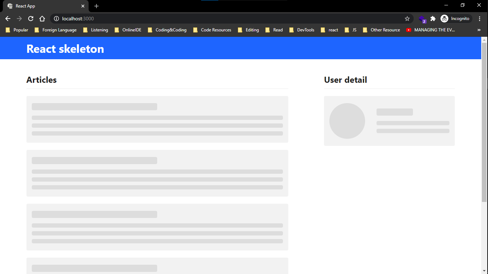

# Simple Skeleton Loading with Reactjs ⚛


Made by follow [this tutorial](https://www.youtube.com/watch?v=cg_tmJBisp8&list=PL4cUxeGkcC9i6bZhMuAzQpC6YgLmB4k4-)

## Preview Image



## To run

### Clone this project then run

```npm
yarn install
yarn start
```
